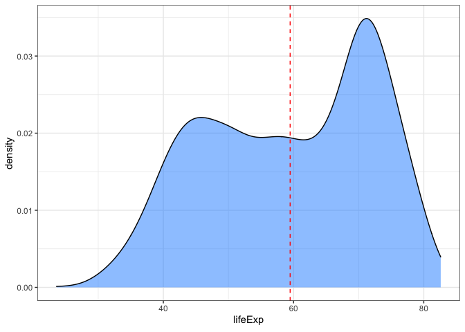
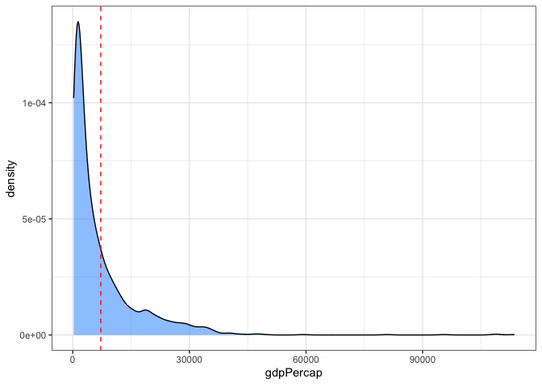
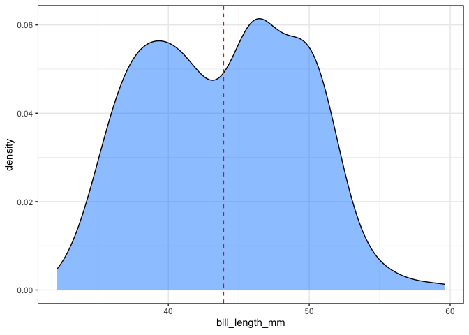
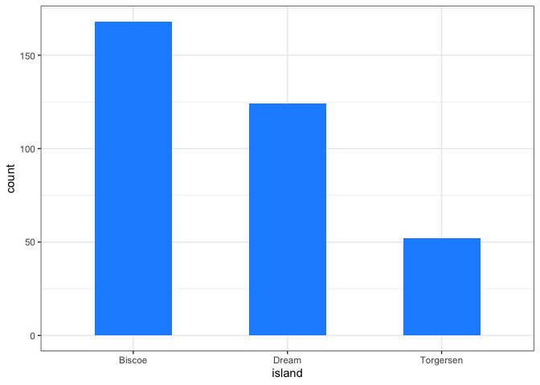
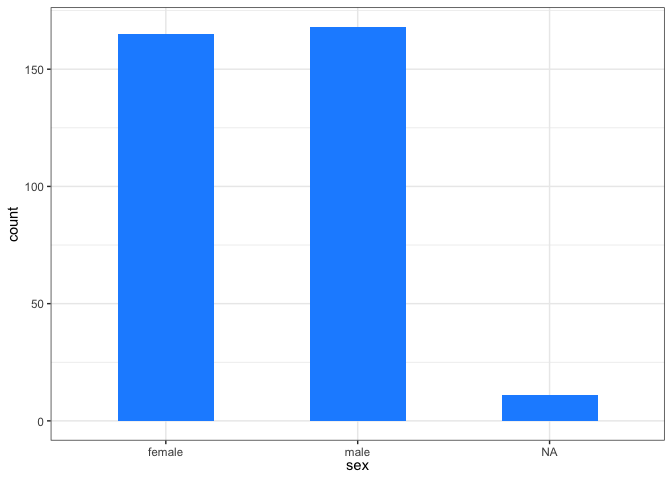

Assignment B1
================

This assignment covers making a function in R, documenting it, and
testing it. For more details on this assignment see
<https://stat545.stat.ubc.ca/assignments/assignment-b1/>.

We begin by loading the `tidyverse` package below:

``` r
suppressPackageStartupMessages(library(tidyverse))
```

## Exercise 1 & 2: Make a Function and Documentation

One of the plots that I have found very useful when working on a new
dataset is the distribution of variables. Below, I wrote a function to
plot the distribution given the data and the variable’s name. The
function handles both categorical and numerical data. Also, I have tried
to provide as much information as possible within the output plot. For
example, I am indicating the mean of the numerical variable with a
vertical line. At last, We document the function modules using
`roxygen2` tags.

``` r
#' @title quick_dist: quick distribution plotting of variables in a data frame
#' 
#' @description quick_dist function takes two arguments as the input, a data frame and one of its columns. It plots the distribution of the given variable in the dataset.
#' 
#' @param df: A data frame object. The output plot is based on one of df's variables. Since it should be a data frame, we have called it "df," the initials of the data frame.
#' 
#' @param var_name: A variable (column) in characters format in the provided data frame, df. It should be an object of numeric, factor (categorical), or character classes. If numeric, the output is the density plot of the distribution. If factor or character, the output is a bar chart of frequencies of categories. Since it reflects the name of a variable in characters (double quotations), we have called it "var_name" in the function's body.
#' 
#' @param na.rm: If TRUE, the default, missing values are silently removed. If FALSE, missing values are removed with a warning. We have got the name by putting together the words NA and remove.
#' 
#' @return: A plotted distribution based on the given column in the data frame input. Based on the class of input variable, it is either a density plot of the distribution or a bar chart of counts of categories.
#'  

quick_dist <- function(df, var_name, na.rm = TRUE){
  
  if (!is.data.frame(df)){
    stop('The parameter df should be a data frame object.\n',
         'You have provided an object of class: ', class(df)[1])
  }
  
  if (!is.character(var_name)){
    stop('The parameter var_name requires a character input.\n',
         'You have provided an object of class: ', class(var_name)[1])
  }
  
  if (!var_name %in% colnames(df)){
    stop('The var_name parameter does 
         not exist in the provided data frame.\n')
  }
  var_name <- as.name(var_name)
  var <- df[[var_name]]
  
  if (!is.numeric(var) &&
      !is.factor(var) &&
      !is.character(var)){
    stop("The column specified by the parameter var_name
         requries a numeric, factor or character variable, \n",
         'You have provided an object of class: ', class(var)[1])
      }
  
  if (is.numeric(var)){
    
    mu <- mean(var, na.rm = na.rm)
    plt <- df %>%
      filter(if (na.rm == TRUE) !is.na(!!var_name) else TRUE) %>%
      
      ggplot(aes(!!var_name)) +
      
      geom_density(fill = 'dodgerblue', alpha = 0.5) +
      geom_vline(aes(xintercept=mu), linetype="dashed", color='red') +
      
      theme_bw() +
      xlab(var_name)
  }
  
  else if (is.factor(var) || is.character(var)){
    
    plt <- df %>%
        filter(if (na.rm == TRUE) !is.na(!!var_name) else TRUE) %>%
      
        ggplot(aes(!!var_name)) +
        geom_bar(fill='dodgerblue', width = 0.5) +
      
        theme_bw() +
        xlab(var_name)
  }
  return(plt)
}
```

## Exercise 3: Include examples

Here, we demonstrate some use cases of our function in real-world
datasets. We have used `gapminder` and `penguins` datasets for this
purpose. Run the below code chunk to load these datasets.

``` r
suppressPackageStartupMessages(library(gapminder))
suppressPackageStartupMessages(library(palmerpenguins))
```

First, we show the functionalities of our function on the `gapminder`’s
variables. The first two examples are numerical columns, and the outputs
are density distributions as expected. The last example includes a
categorical variable in the data, which the output will be a bar plot of
categories frequencies.

``` r
# Getting the distributions of the gapminder variables
quick_dist(gapminder, "lifeExp") # a numeric variable distribution
```

<!-- -->

``` r
quick_dist(gapminder, "gdpPercap") # a numeric variable
```

<!-- -->

``` r
quick_dist(gapminder, "continent") # a categorical variable distribution
```

<!-- -->

Here again, we show some examples of exploring variables of `penguins`
using `quick_dist.` In the last example, we set the `na.rm` to `FALSE,`
as you can see, we have a column of `NA` and its count. So the function
also can be used to see how many `NA` values are in a variable.

``` r
# Getting the distributions of the penguins variables
quick_dist(penguins, "bill_length_mm") # a numeric variable
```

<!-- -->

``` r
quick_dist(penguins, "island") # a categorical variable
```

<!-- -->

``` r
quick_dist(penguins, "sex", na.rm = FALSE) # a categorical variable with setting na.rm to FALSE
```

<!-- -->

In the next code section, we illustrate how things might go wrong when
using the `quick_dist()` function and how they are handled in the
function.

``` r
# invalid data frame input, in this case a numeric value
df <- 1.1
quick_dist(df, "lifeExp")
```

    ## Error in quick_dist(df, "lifeExp"): The parameter df should be a data frame object.
    ## You have provided an object of class: numeric

``` r
# invalid variable name, should be a var name in characters
quick_dist(gapminder, 1.2)
```

    ## Error in quick_dist(gapminder, 1.2): The parameter var_name requires a character input.
    ## You have provided an object of class: numeric

``` r
quick_dist(gapminder, "life") # invalid variable name, should be a variable in gapminder dataset
```

    ## Error in quick_dist(gapminder, "life"): The var_name parameter does 
    ##          not exist in the provided data frame.

## Exercise 4: Test the Function

For writing tests for the function, first, we should load `testthat`
package.

``` r
suppressPackageStartupMessages(library(testthat))
```

``` r
# Creating two type of plots for testing

plt1 <- quick_dist(gapminder, "lifeExp")
plt2 <- quick_dist(gapminder, "continent")
  
test_that("Testing whether the output for a numeric variable are density and vlines plots and for a categorical, a bar chart.", {
  
  expect_true(
        "GeomDensity" %in% class(plt1$layers[[1]]$geom) &&
        "GeomVline" %in% class(plt1$layers[[2]]$geom)
    )
  expect_true(
        "GeomBar" %in% class(plt2$layers[[1]]$geom)
    )
})
```

    ## Test passed 🌈

``` r
test_that("Testing whether aesthetic mappings are correct in both type of plots",
      {
        expect_equal(as.character(rlang::get_expr(plt1$mapping$x)), "lifeExp")
        expect_equal(as.character(rlang::get_expr(plt2$mapping$x)), "continent")
      })
```

    ## Test passed 🌈

``` r
test_that("Testing whether the function accept invalid input arguments",
      {
        expect_error(quick_dist("2", 12))
        expect_error(quick_dist(2.3, "lifeExp"))
        expect_error(quick_dist(gapminder, 1.23))
        expect_error(quick_dist(gapminder, "aaaa"))
        expect_error(quick_dist(gapminder, lifeExp))
      })
```

    ## Test passed 😀
